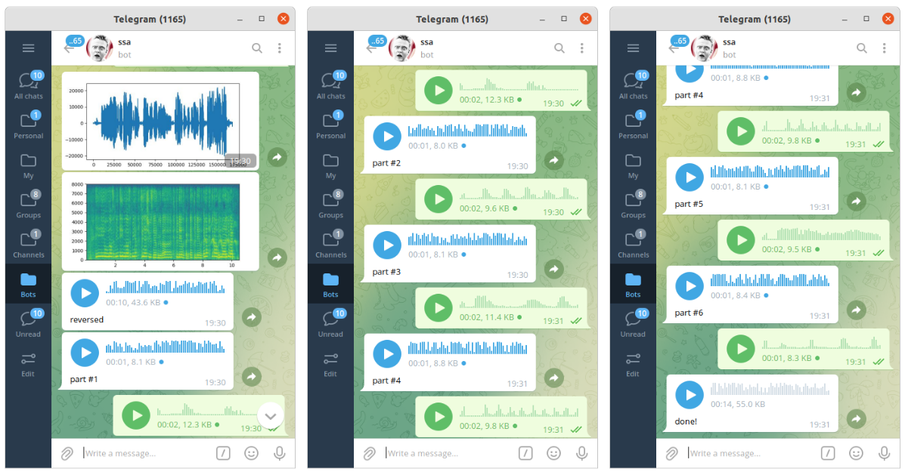

#### A Funny Game Based on Reversing Audio

This is an implementation of a game called "SSA". It was invented by Aleksandr Pushnoy back in 2004. The idea is simple - you're singing a song, it's being recorded, then reversed and cut in pieces. Someone from the opposite team then listens to it and tries to imitate the same with their own voice. Finally, it's reversed again, and the task is to guess what song it was :) [demo](https://t.me/vaaliferov_ssa_bot)

  